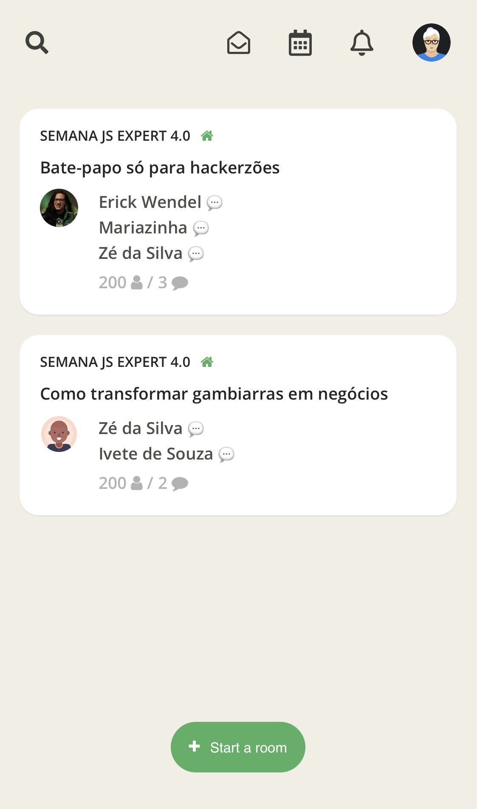
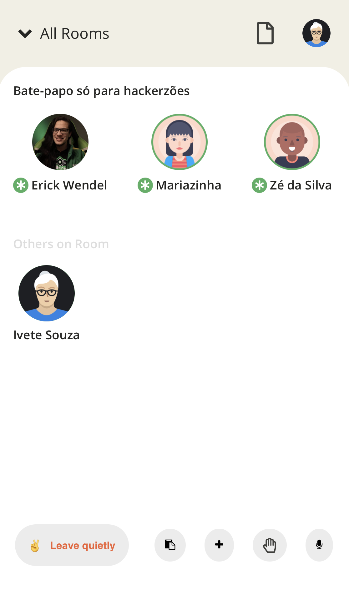

# ClubHouse Clone Template - Semana JS Expert 4.0

Seja bem vindo(a) à quarta Semana Javascript Expert.Este é o código inicial para iniciar nossa jornada.

Marque esse projeto com uma estrela 🌟

## Tecnologias utilizadas
- [socket.io (client/server - (rooms))](https://socket.io/)
- [peerJS (WebRTC)](https://peerjs.com/)
- [firebase (auth)](https://firebase.google.com/)

## Tecnologias adicionais
- [Typescript](https://www.typescriptlang.org/) - apenas checagem estática, transpilado para ESNext para manter compatibilidade com a proposta do evento.
## Preview

### Página de Login

### Página de Salas

### Página de Sala

## Checklist Features

- [ ] O app deve funcionar na Web, Android e IOS
- Login
  - [x] Deve ter login com GitHub
    - [x] Se houver dados do usuario em localStorage deve ir para lobby direto

- Lobby
  - [x] Se não houver dados do usuario em localStorage deve voltar para login
  - [x] Mostra todas as salas ativas
  - [x] Atualiza salas em realtime
  - [x] Pode criar uma sala sem topico
  - [x] Pode criar uma sala com topico
  - [x] Pode acessar salas ativas
- Room
  - [x] Se não houver dados do usuario em localStorage deve voltar para login
  - [x] Cria uma sala com um usuário dono
  - [x] Todos usuários futuros entram com perfil de attendees
  - [x] Notifica Lobby sobre atualizações na sala
  - [x] Lista usuarios com perfis de speakers e attendees
  - [x] Se o dono da sala desconectar, será removida
  - Users
    - Speaker
      - [x] Recebe notificação de attendees para se tornarem speakers
      - [x] Atualizam a tela o upgrade de attendee para speaker
      - [x] Poderá deixar seu microfone mudo
      - Se dono da sala
        - [x] Pode aprovar attendees a virarem speakers
        - Ao se desconectar
          - [x] Promove o speaker mais velho da sala
          - [x] Se não houver speaker promove o attendee mais velho da sala
    - Attendee
      - [x] Pode ouvir speakers ativos
      - [x] Pode pedir upgrade de perfil ao dono da sala
        - Ao ser aprovado
          - [x] Reinicia todas as suas chamadas ativas com os usuarios da sala
          - [x] Recebe as permissões do perfil speaker
